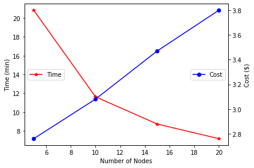

# supercomp-group18
### Software Improvements
Considering the fact that the DataFrame implementation performed better in the experiments that we ran locally, we opted against an RDD implementation. Moreover, given that Spark SQL is especially designed and optimized to run with structured data we modified the previous DataFrame implementation into one that took advantage more of the benefits of Datasets in Spark SQL. Thereby, in this section we will present the changes that we made in order to achieve a better performance.

The former approach had all the logic encompassed into a single map function which received as input a row containing a date and the aggregated list of strings corresponding to the "allnames" entries of that particular date and was giving as an output a tuple which contained the date and the required list of tuples (string, number of apparitions). This was barely using the Spark SQL capabilities so it was changed drastically.

Currently, in order to only perform operation on the data that we are interested in, a select was performed to isolate the "date" and "allnames" columns. By doing so, the following explode operation, will only copy the date field for the resulting split strings, instead of copying also the remaining 25 unused fields. Moreover, the split is not based anymore on comma and semicolon, but it contains a regular expression that matches every string starting with a comma and ending with non-letter characters. This was done so that the number resulting strings after split will be significantly lowered since the numbers are now completely ignored. However, a filter for strings that contained letters was still performed to ensure that no other characters were kept. Following, the occurrences of words by date was computed by grouping the dataset by date and names and adding the result to a third column. The extraction of the top 10 counted words by date was performed by using a query with window aggregation function. The rank of an entry was defined in relation to its word count and the dataset was partitioned by date. The qurey returned the top 10 ranked entries from each partition. On the resulting dataset, the counts and the names were merged and, finally, the data was grouped by date and aggregated into a list. To manage the number of output files that the script was writing, the dataset was repartitioned into one partition so that the result will be just one file. 

### Configuration

In a company scenario we considered that an optimum configuration would be a trade-off between the execution time and required costs.

Our approach was to first process the entire data-set using the configuration mentioned in the assignment's manual, namely using 20 **c4.8xlarge** core nodes. The processing time obtained was 430 seconds which, by conversion, means 7 minutes and 10 seconds.

In order to properly optimize our configuration, we checked the *Resource Management* to understand the workflow. We observed that our default configuration (**c4.8xlarge** with 20 core nodes) was using *992.38 GB* out of *1.02TB* of memory an only *181* out of *720* cores available. For this reason, we considered that the amount of memory was, indeed, properly chosen. However, the number of processors was too high for the requirement of the application and resulted in plenty of unused cores. Thereby, we considered decreasing the number of nodes we are using in order to reach the price-costs trade-off. Our aim was to succeed in processing the whole data-set within half an hour with low costs.

In the above figure we display the time and cost with respect to the number of nodes. We performed an analysis for 5, 10, 15 and 20 nodes. We need to mention that the time metric chosen for this plot was minutes and the one for the costs was dollars ($). We could observe that in all cases the data-set is processed in less than 30 minutes, thus we reached our goal. However, we could observe that the processing time for 5 nodes is almost 2 times higher than the one for 10 nodes. However, when looking at the prices, we could observe that the cost for 5 nodes is just $0.3 lower than the cost for 10 nodes. For this reason, we consider that the best trade-off between costs and time would be the configuration with 10 **c4.8xlarge** nodes. The cost for using 10 **c4.8xlarge** nodes would be **$3.08**.

Besides the aforementioned configurations, we also explored other instance types available on AWS in order to further reduce our costs withouth affecting our performances.

| Type | No. slaves | Time (min) | Cost ($) |
|---|---|---|---|
| c4.8xlarge | 20 | 7.17 | 3.8 |
| c4.8xlarge | 15 | 8.73 | 3.47 |
| c4.8xlarge | 10 | 11.63 | 3.08 |
| c4.8xlarge | 5 | 20.83 | 2.76 |
| c4.4xlarge | 20 | 9.03 | 2.39 |
| **c4.4xlarge** | **15** | **11.43** | **2.28** |
| c4.4xlarge | 10 | 16.53 | 2.19 |
| c4.2xlarge | 20 | 16.53 | 2.19  |
| c4.2xlarge | 15 | 22.2 | 2.21 |

The above table presents the execution time for different configurations and their associated cost. We wanted to observe what would be the impact of using a larger number of cheaper instances on the execution time and, implicitly, on the cost. The chosen trade-off is highlighted on the table. It was selected due to its lower price compared to a similarly performing configuration (c4.8xlarge with 10 slaves) and because, although the usage of weaker configurations resulted in a lower cost, the gain in money against the extra time spent was not sufficient.
